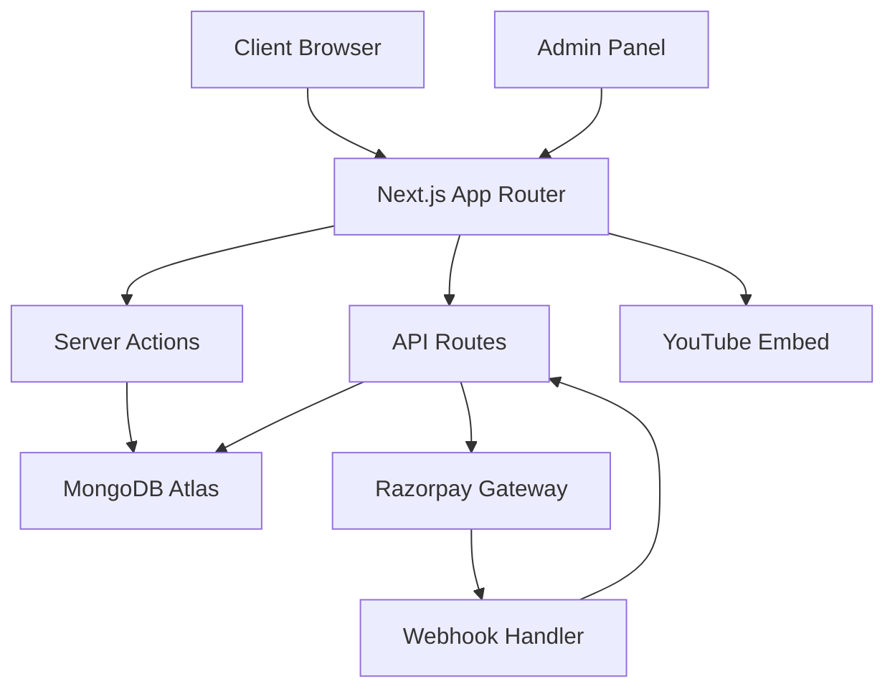

# Design Document: Career Path Institute LMS

## Overview

The Career Path Institute LMS is a comprehensive educational platform built with Next.js 14 App Router, featuring course management, ecommerce capabilities, mock testing, and administrative controls. The system uses MongoDB Atlas for data persistence, Razorpay for payments, and implements robust video protection mechanisms for premium content delivery.

The architecture follows a modern full-stack approach with server-side rendering, API routes, and client-side interactivity. The platform serves students preparing for competitive exams while providing administrators with comprehensive management tools.

## Architecture

### Technology Stack
- **Frontend**: Next.js 14 (App Router), React 18, TypeScript
- **Styling**: Tailwind CSS v4 with custom theme configuration
- **UI Components**: ShadCN UI (essential components only)
- **Backend**: Next.js API Routes, Server Actions
- **Database**: MongoDB Atlas with Mongoose ODM
- **Authentication**: NextAuth.js with JWT strategy
- **Payments**: Razorpay integration with webhook verification
- **Video Hosting**: YouTube (private/unlisted playlists)
- **Deployment**: Vercel (recommended) or similar platform

### System Architecture



### Folder Structure
```
src/
├── app/
│   ├── (auth)/
│   │   ├── login/
│   │   └── register/
│   ├── (dashboard)/
│   │   ├── admin/
│   │   └── student/
│   ├── courses/
│   ├── books/
│   ├── current-affairs/
│   ├── mock-tests/
│   ├── blog/
│   └── api/
├── components/
│   ├── ui/
│   ├── forms/
│   ├── layout/
│   └── features/
├── lib/
│   ├── db/
│   ├── auth/
│   ├── payments/
│   └── utils/
├── models/
└── types/
```

## Components and Interfaces

### Core Components

#### Authentication System
- **NextAuth Configuration**: JWT strategy with credential provider
- **Middleware Protection**: Route-level authentication guards
- **Token Management**: Automatic refresh with secure storage
- **Role-based Access**: Student and Admin role differentiation

#### Course Management System
- **Dynamic Course Structure**: Configurable sections and content types
- **Progress Tracking**: Individual student progress monitoring
- **Content Delivery**: Secure video, PDF, and quiz distribution
- **Access Control**: Purchase-based content unlocking

#### Video Protection Layer
- **YouTube Integration**: Private/unlisted playlist embedding
- **Custom Player Overlay**: Masked iframe with disabled interactions
- **Right-click Prevention**: CSS and JavaScript-based protection
- **Source Obfuscation**: Hidden YouTube origin through proxy methods

#### Payment Processing
- **Razorpay Integration**: Order creation and payment processing
- **Webhook Verification**: Cryptographic signature validation
- **Transaction Logging**: Comprehensive payment audit trail
- **Auto-unlock Mechanism**: Immediate content access post-payment

#### Mock Test Engine
- **Timer System**: Countdown with auto-submission
- **Question Randomization**: Shuffled options and question order
- **Result Calculation**: Scoring algorithms with analytics
- **Performance Tracking**: Historical attempt analysis

### API Interfaces

#### Authentication Endpoints
```typescript
POST /api/auth/register
POST /api/auth/login
GET /api/auth/session
POST /api/auth/refresh
```

#### Course Management
```typescript
GET /api/courses
GET /api/courses/[id]
POST /api/courses (Admin)
PUT /api/courses/[id] (Admin)
DELETE /api/courses/[id] (Admin)
```

#### Payment Processing
```typescript
POST /api/payments/create-order
POST /api/payments/verify
POST /api/webhooks/razorpay
```

#### Mock Tests
```typescript
GET /api/tests
POST /api/tests/[id]/attempt
GET /api/tests/[id]/results
```

## Data Models

### User Schema
```typescript
interface User {
  _id: ObjectId;
  email: string;
  password: string; // hashed
  name: string;
  role: 'student' | 'admin';
  profile: {
    phone?: string;
    address?: string;
  };
  purchases: ObjectId[]; // references to orders
  createdAt: Date;
  updatedAt: Date;
}
```

### Course Schema
```typescript
interface Course {
  _id: ObjectId;
  title: string;
  description: string;
  price: number;
  thumbnail: string;
  sections: Section[];
  isActive: boolean;
  createdAt: Date;
  updatedAt: Date;
}

interface Section {
  _id: ObjectId;
  title: string;
  order: number;
  videos: Video[];
  materials: Material[];
  quizzes: Quiz[];
}

interface Video {
  _id: ObjectId;
  title: string;
  youtubeId: string;
  duration: number;
  isFree: boolean;
  order: number;
}
```

### Order Schema
```typescript
interface Order {
  _id: ObjectId;
  userId: ObjectId;
  items: OrderItem[];
  totalAmount: number;
  status: 'pending' | 'completed' | 'failed' | 'refunded';
  razorpayOrderId: string;
  razorpayPaymentId?: string;
  paymentDetails: any;
  createdAt: Date;
  updatedAt: Date;
}

interface OrderItem {
  type: 'course' | 'book' | 'material' | 'test';
  itemId: ObjectId;
  price: number;
  title: string;
}
```

### Test Schema
```typescript
interface MockTest {
  _id: ObjectId;
  title: string;
  description: string;
  duration: number; // in minutes
  sections: TestSection[];
  price: number;
  isActive: boolean;
  createdAt: Date;
}

interface TestSection {
  _id: ObjectId;
  title: string;
  questions: Question[];
  timeLimit?: number;
}

interface Question {
  _id: ObjectId;
  text: string;
  options: string[];
  correctAnswer: number;
  explanation?: string;
  marks: number;
}

interface TestAttempt {
  _id: ObjectId;
  userId: ObjectId;
  testId: ObjectId;
  answers: Answer[];
  score: number;
  totalMarks: number;
  timeSpent: number;
  completedAt: Date;
}
```

### Blog Schema
```typescript
interface BlogPost {
  _id: ObjectId;
  title: string;
  slug: string;
  content: string;
  excerpt: string;
  featuredImage?: string;
  category: string;
  tags: string[];
  author: ObjectId;
  isPublished: boolean;
  seo: {
    metaTitle: string;
    metaDescription: string;
    keywords: string[];
  };
  createdAt: Date;
  updatedAt: Date;
}
```

## Correctness Properties

*A property is a characteristic or behavior that should hold true across all valid executions of a system—essentially, a formal statement about what the system should do. Properties serve as the bridge between human-readable specifications and machine-verifiable correctness guarantees.*

### Authentication and Access Control Properties

**Property 1: User Registration and Authentication Flow**
*For any* valid email and password combination, registering a new user should create an account, generate JWT tokens, and allow subsequent login with the same credentials.
**Validates: Requirements 1.1, 1.2**

**Property 2: JWT Token Validation**
*For any* protected route access attempt, only valid JWT tokens should grant access while invalid or expired tokens should be rejected.
**Validates: Requirements 1.3**

**Property 3: Automatic Token Refresh**
*For any* expired JWT token, the system should automatically refresh it without user interruption when the user is actively using the platform.
**Validates: Requirements 1.5**

### Content Access and Purchase Properties

**Property 4: Purchase-based Content Unlocking**
*For any* successful payment for courses or study materials, all associated content should become immediately accessible to the purchasing user.
**Validates: Requirements 2.1, 5.2**

**Property 5: Free Content Access**
*For any* course section, exactly one video should be accessible without purchase while all other content remains locked.
**Validates: Requirements 2.4**

**Property 6: Video Protection Implementation**
*For any* video embed, the iframe should have disabled right-click, masked YouTube branding, and proper security attributes to prevent easy downloading.
**Validates: Requirements 2.3, 2.7**

### Payment Processing Properties

**Property 7: Complete Payment Flow**
*For any* checkout process, successful Razorpay payment should result in stored transaction records, generated invoices, and unlocked content, while failed payments should preserve cart state and display errors.
**Validates: Requirements 3.3, 3.4, 3.5, 3.6**

**Property 8: Cart State Management**
*For any* shopping cart operations, adding items should maintain session state, calculate correct totals, and preserve cart contents across page refreshes.
**Validates: Requirements 3.2**

### Testing System Properties

**Property 9: Mock Test Timer and Submission**
*For any* mock test attempt, the timer should count down correctly and automatically submit the test when time expires, regardless of user actions.
**Validates: Requirements 4.1**

**Property 10: Question Randomization**
*For any* test generation, MCQ options should be shuffled differently across multiple attempts of the same test to prevent cheating.
**Validates: Requirements 4.2**

**Property 11: Score Calculation and Analytics**
*For any* completed test, the score should be calculated correctly based on correct answers, and performance analytics should be generated and stored.
**Validates: Requirements 4.3, 4.4, 4.5**

### Content Organization Properties

**Property 12: Dynamic Content Organization**
*For any* content type (courses, tests, current affairs), items should be properly organized by their specified categories, sections, or time periods.
**Validates: Requirements 2.2, 4.6, 5.4**

**Property 13: Content Delivery Completeness**
*For any* course or study material, all associated content types (videos, PDFs, quizzes) should be delivered together and properly linked.
**Validates: Requirements 2.6**

### Progress and History Tracking Properties

**Property 14: Progress Tracking Accuracy**
*For any* student content interaction, progress should be accurately recorded and displayed, reflecting actual completion status.
**Validates: Requirements 2.5**

**Property 15: User Dashboard Data Display**
*For any* authenticated user, their dashboard should display all purchased items, test history, payment records, and profile information accurately.
**Validates: Requirements 1.4, 1.6**

### Administrative Management Properties

**Property 16: Comprehensive Admin Controls**
*For any* admin user, all management interfaces (courses, users, orders, content) should be accessible and functional for CRUD operations.
**Validates: Requirements 6.1, 6.2, 6.3, 6.4**

**Property 17: Analytics and Payment Tracking**
*For any* platform activity, analytics should be calculated correctly and all transaction details should be visible to administrators.
**Validates: Requirements 6.5, 6.6**

### Content Management Properties

**Property 18: Rich Text Content Handling**
*For any* rich text content creation (blog posts, current affairs), the editor should properly store and display formatted content with all features intact.
**Validates: Requirements 5.6, 7.4**

**Property 19: Search and Filter Functionality**
*For any* content with search capabilities (current affairs, blog posts), search and filter operations should return accurate results based on the specified criteria.
**Validates: Requirements 5.3**

### SEO and Blog Properties

**Property 20: SEO Optimization Implementation**
*For any* blog post or page, proper meta tags, structured data, and SEO elements should be generated and served correctly.
**Validates: Requirements 7.1, 7.2, 8.6**

**Property 21: Dynamic URL Generation**
*For any* blog post creation, a unique slug-based URL should be generated and the post should be accessible via that URL.
**Validates: Requirements 7.3**

**Property 22: Related Content Recommendations**
*For any* blog post, related posts should be identified and displayed based on categories, tags, or content similarity.
**Validates: Requirements 7.5**

### Security and Data Integrity Properties

**Property 23: Route Protection and Security**
*For any* protected route or sensitive operation, proper middleware validation should occur and unauthorized access should be prevented.
**Validates: Requirements 8.2, 8.4**

**Property 24: Error Handling and Recovery**
*For any* error condition (404, 500, validation errors), appropriate error pages or messages should be displayed and the system should handle errors gracefully.
**Validates: Requirements 8.5**

**Property 25: Data Validation and Storage**
*For any* data input or upload, content should be validated against defined schemas and stored with proper relationships maintained.
**Validates: Requirements 9.1, 9.2**

**Property 26: API Response Formatting**
*For any* API endpoint call, responses should match the defined specifications and include all required fields in the correct format.
**Validates: Requirements 9.3**

### Theme and UI Properties

**Property 27: Theme Customization**
*For any* theme color modification, changes should be applied consistently across all UI components and pages.
**Validates: Requirements 10.1, 10.5**

**Property 28: Responsive Design Implementation**
*For any* screen size or device, UI components should render properly and maintain functionality across different viewports.
**Validates: Requirements 10.2**

**Property 29: Component Library Usage**
*For any* UI component implementation, only essential ShadCN components should be used without unnecessary library dependencies.
**Validates: Requirements 10.4**

## Error Handling

### Global Error Boundaries
- React Error Boundaries for client-side error catching
- Custom 404 and 500 error pages with user-friendly messaging
- API error standardization with consistent error response format
- Logging integration for error tracking and monitoring

### Payment Error Handling
- Razorpay webhook failure retry mechanisms
- Payment timeout handling with user notification
- Cart state preservation during payment failures
- Refund processing with automatic status updates

### Authentication Error Management
- JWT token expiration handling with automatic refresh
- Invalid credential messaging without security information leakage
- Session timeout warnings with extension options
- Rate limiting for authentication attempts

### Content Delivery Error Handling
- Video loading failure fallbacks
- PDF download error recovery
- Quiz submission failure with local state preservation
- Progress tracking error recovery mechanisms

## Testing Strategy

### Dual Testing Approach

The testing strategy employs both unit testing and property-based testing to ensure comprehensive coverage:

**Unit Tests**: Focus on specific examples, edge cases, and integration points
- Authentication flow examples with valid/invalid credentials
- Payment processing with mock Razorpay responses
- Video protection implementation verification
- Admin panel functionality with specific user scenarios
- Error condition handling with known failure cases

**Property-Based Tests**: Verify universal properties across all inputs using **fast-check** library
- Minimum 100 iterations per property test for thorough coverage
- Each property test references its corresponding design document property
- Tag format: **Feature: career-path-lms, Property {number}: {property_text}**
- Comprehensive input generation for robust testing

### Property-Based Testing Configuration

**Library**: fast-check (JavaScript/TypeScript property-based testing library)
**Test Runner**: Jest with fast-check integration
**Iteration Count**: Minimum 100 iterations per property test
**Generators**: Custom generators for domain-specific data (users, courses, payments, tests)

### Testing Coverage Areas

**Authentication and Security**:
- User registration and login flows
- JWT token validation and refresh mechanisms
- Route protection and access control
- Payment security and webhook verification

**Content Management**:
- Course and section organization
- Video protection and delivery
- Progress tracking accuracy
- Content access control post-purchase

**Payment Processing**:
- Razorpay integration and webhook handling
- Order creation and completion flows
- Invoice generation and transaction logging
- Cart state management and persistence

**Mock Testing System**:
- Timer functionality and auto-submission
- Question randomization and scoring
- Performance analytics and ranking calculation
- Test history and attempt tracking

**Administrative Functions**:
- Content management operations
- User and order management
- Analytics calculation and display
- System configuration and maintenance

Each correctness property will be implemented as a single property-based test, ensuring that the system behavior is verified across a wide range of inputs and scenarios.